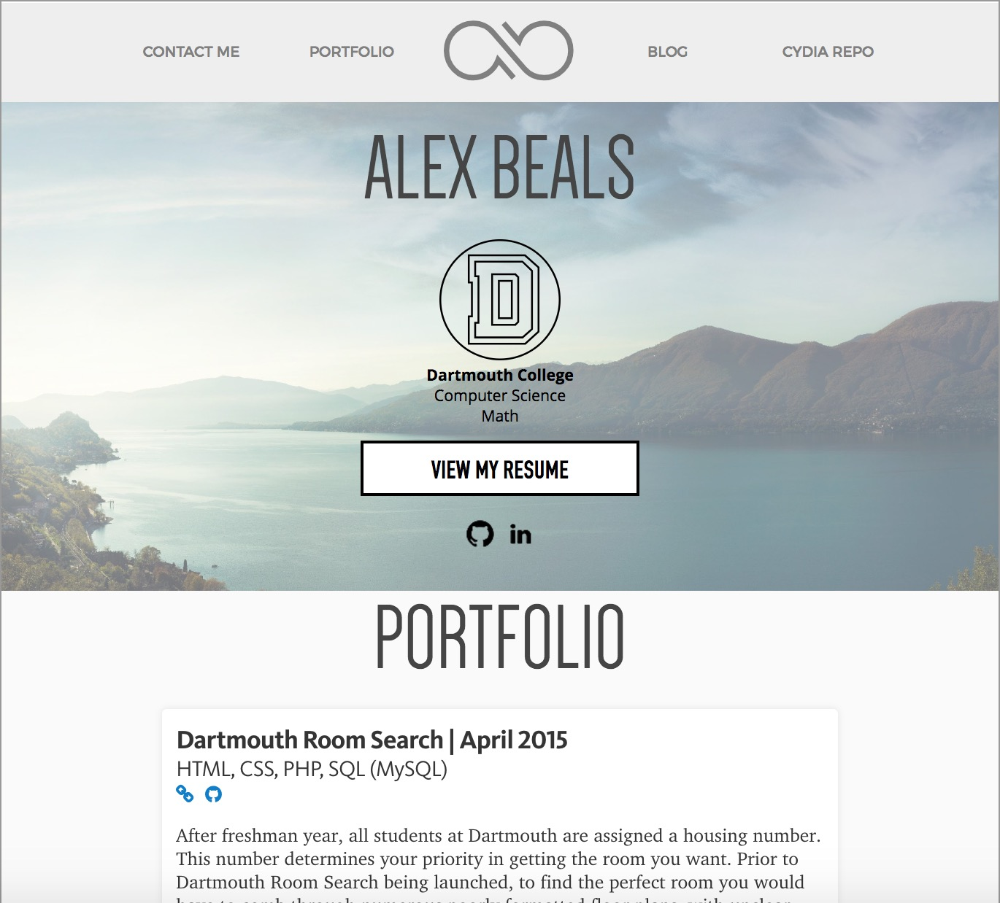
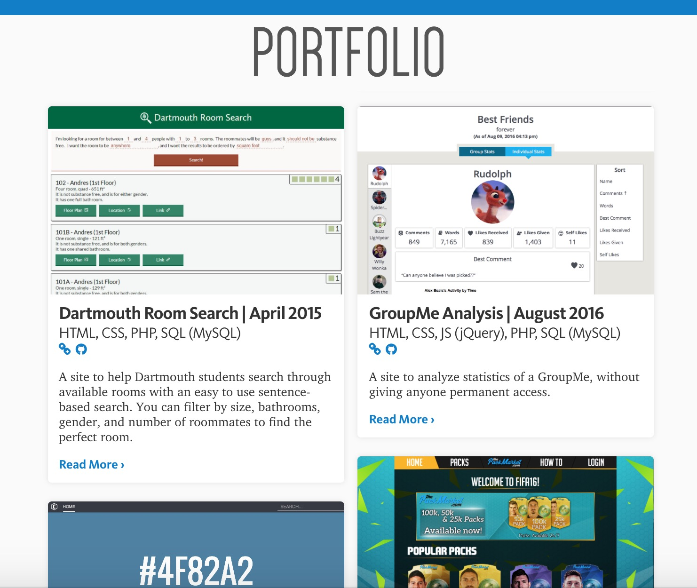
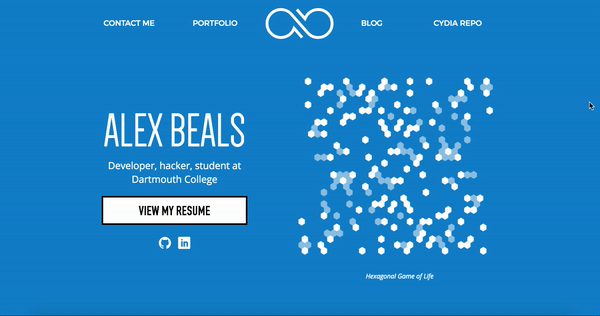

# Personal Website

I've had a personal website (https://alexbeals.com) for a while now, but recently it went through a pretty major revamp.  Previously it looked like this:

  

While it was fine, I wasn't a huge fan of it.  For one, there wasn't that much color in it.  Additionally, none of the projects had images, so scanning the page was just skimming over a large amount of text.  Additionally, the preview snippets of text were just the first paragraphs of writeup about it, so it wasn't written to be interesting.

For the modifications, I wanted to keep what I liked about it.  I liked the blue highlight color, so that became much more dominant.  I liked the top landing area with my name and resume, so I kept a modified version of that (though I removed the direct references to my major and college).  I liked the general "card" layout of the projects, but I combined it into two columns with images to spruce it up more and add some more asymmetry to the page.

   
  <i>The new project previews</i>

Additionally, I added something relatively substantial: an animated hexagonal [Game of Life](https://en.wikipedia.org/wiki/Conway%27s_Game_of_Life).  I wanted something to break up the landing page, and also wanted it to be something somewhat interesting and non-static.  I liked the Game of Life, but thought the normal grid wouldn't have been that interesting.  Instead I looked into making a hexagonal grid, and then making my own custom rules.  These are roughly similar to the normal rules, but there's much more turnover, which keeps it more lively and keeps it from getting into a repeating pattern.

  

I'm much more happy with the website now.  It's more immediately captivating, and it shows off what I've worked on better than the previous version.  It also has a lot of behind-the-scenes improvements in terms of how easy it is for me to add new projects.
